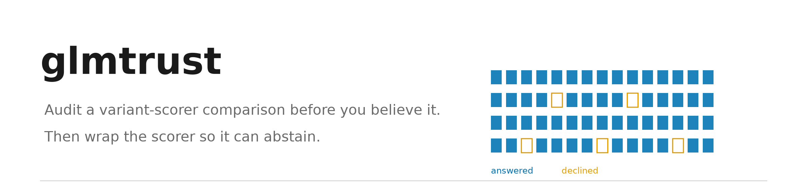
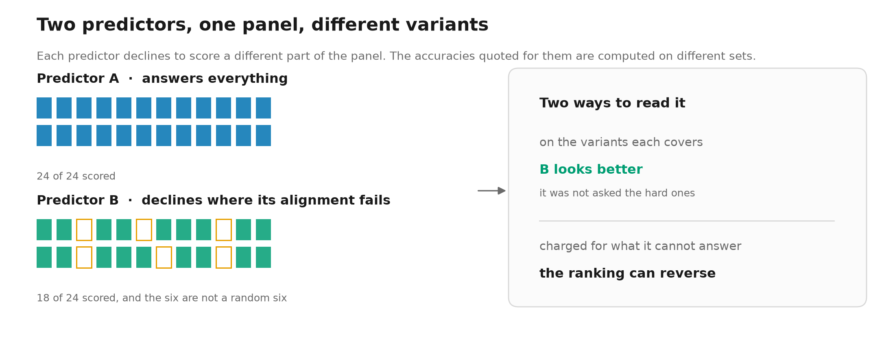

# glmtrust

[](glmtrust/tests)
[](LICENSE)
[](https://www.python.org/)
[](https://colab.research.google.com/github/asediya/evo2-reliability-atlas/blob/main/notebooks/quickstart.ipynb)

Varunkumar Asediya, Udayaraja GK, Haja N. Kadarmideen and Chandra S. Pareek

**Audit a variant-scorer comparison before you believe it. Then wrap the scorer so it can abstain.**

Two variant effect predictors are rarely evaluated on the same variants, because each declines to
score a different part of the panel. The accuracies quoted for them are then computed on different
sets and read as a ranking. `glmtrust` measures that, and gives you a scorer that says "I don't
know" instead of guessing.




> **One code base, two copies.** The project home page,
> `https://github.com/asediya/evo2-reliability-atlas`, and the article's Additional file 2 hold
> identical code, under the MIT License. The Zenodo record `10.5281/zenodo.22046811` mirrors the
> submitted additional files and is released on acceptance, so that DOI does not resolve yet. Its
> being live is not a prerequisite for anything here: every gate, test and recompute step runs
> from the deposit alone, or names the undeposited input it wants.

> **A note on archive timestamps.** Every entry in Additional file 2 carries a normalised
> `2026-01-01` modification time. That is deliberate: a fixed timestamp is what makes the
> archive byte-reproducible, so two builds of the same tree produce the same file. The
> consequence is that the deposit carries no temporal provenance and a reader cannot date
> its contents from the zip; `.git` is not included either. Provenance for every path is in
> `reports/DATA_MANIFEST.md`.
>
> `tools/build_code_zip.py`'s `collect()` covers the code tree; `check_manifest.py`,
> `LICENSING.md`, the BRCA1 `.pdb` models and `README.md` under `data/raw/structures/`, the
> Figure S6 structure PNGs under `reports/figures/`, and `MANIFEST.sha256` itself are added beside
> it. Every shipped file except `MANIFEST.sha256` itself is declared in it, since the manifest cannot list
> itself, and `check_manifest.py` verifies every declared file; it prints how many it listed and how many it
> found, and the two agree.

## Contents

- [Install](#install)
- [Audit a comparison](#audit-a-comparison)
- [The trust layer](#the-trust-layer)
- [Notebook](#notebook)
- [Analysis code](#analysis-code)
- [License](#license)

## Install

```bash
pip install './glmtrust[io]'
```

Python 3.9+, numpy, scipy and scikit-learn. The `[io]` extra adds polars for parquet input. No GPU,
no model weights, nothing to download.

## Audit a comparison

You have two scorers and one panel, and one of them cannot score every variant.

```python
from glmtrust import Scorer, audit

report = audit(labels, [
    Scorer("scorer_a", a, readout="per-substitution score"),
    Scorer("scorer_b", b, readout="per-substitution score"),   # NaN where it declines
])
print(report)
```

For each scorer it reports how much of the panel it reaches, whether that reach differs by class,
its accuracy on the variants it covers, and its accuracy when every variant must be answered. A
scorer that declines the hard cases looks better on the first number and worse on the second.

Warnings print before the numbers, because the numbers are what get quoted and the warnings are the
reason not to.

Where score values cannot be shared, `glmtrust reach` works from reach indicators and each scorer's
covered AUROC. It counts the comparisons the bound identifies and gives each its breakdown point, the
share of declined pairs that may resolve arbitrarily before the order is lost, with the frontier over a
grid of that share (`--lambdas`). `glmtrust baseline` fits the sequence-blind baselines an accuracy
should be read against, the pathogenic rate of each variant's gene, of its consequence class and of the
two together, out of fold; `python glmtrust/benchmarks/reproduce_paper_baseline.py --panel
dbnsfp_reach_panel.parquet` returns the paper's 0.880, 0.837 and 0.974 from Additional file 4 of the
article, the reduced dbNSFP panel, which is archived with the article's data rather than in this
repository.

## The trust layer

```python
from glmtrust import TrustLayer

layer = TrustLayer(calibration="isotonic", conformal="mondrian", alpha=0.10, coverage=0.85)
report = layer.fit(scores, labels).evaluate(scores, labels, groups=species)
out = layer.predict(new_scores)      # probability, prediction set, answer-or-abstain
```

`evaluate` scores each group using a map fitted on the others, which is the situation you are in
when the group you care about has no labels of its own. `predict` returns a calibrated probability,
a class-conditional conformal prediction set, and a decision that can be "abstain".

Abstention suppresses false alarms far better than it catches missed positives. It is a precision
aid, not a safety net.

## Notebook

**[notebooks/quickstart.ipynb](notebooks/quickstart.ipynb)** runs all of the above on a fixture that
ships with the package, 11,109 variants across nine species, with no data of your own. Its outputs
are committed as executed.

To run it in the browser with nothing installed, open it in Google Colab with the badge at the
top of this page; its first cell fetches this repository and installs `glmtrust`.

```bash
python glmtrust/benchmarks/reproduce_paper_trust_layer.py
```

Reproduces the published trust-layer numbers from that fixture and exits zero when they match.

## Analysis code

`src/`, `tools/` and `analyses/scripts/` hold the analysis this tool came out of, and
`reports/*.json` holds the recompute layer every published number is read from. They are here so the
results can be checked, not because you need them to use `glmtrust`. `container/` holds the recipe of
the container the Evo 2 scores were produced in, with the versions its archived build carries.

`analyses/scripts/omia_effect_audit.py` sets snpEff's first consequence term against OMIA's curated
variant effect on the atlas positives (Supplementary Note S62) and writes
`reports/omia_effect_audit.json`, which holds counts and AUROCs only. It reads OMIA's variant table,
which carries no open licence and is therefore not deposited; the script's docstring names the download.

Three dog scripts, `src/ccs/dog_liftover_panel.py`, `src/ccs/build_dog_neg.py` and
`src/ccs/build_dog_windows.py`, implement a ROS_Cfam_1.0 lift-over route that did not build the
deposited dog panel; that panel is on CanFam3.1 with no lift-over, as the Methods state.

`src/ccs/build_matched_negatives.py` matches each positive to background variants of the same mutation
type and the nearest local GC. It builds a separate cattle OMIA panel (`data/interim/omia_matched_panel.parquet`)
and none of the atlas's negatives, which are matched on trinucleotide context and alternate allele only;
GC is left unmatched, as `reports/atlas_controls.json` reports.

The step that drew the atlas's negatives in the seven species whose pools come from Ensembl variation,
reading each species' variant pool from its variation file and matching it to the positives, is not
deposited. It fails silently: a pool that misses part of the genome still yields a full draw. The sheep
pool covers only the start of its variation file, whose chromosomes are sorted as text, and ends within
chromosome 2, and the chicken file lacks seven chromosomes that carry positives (Supplementary Note S62).
A rebuild should check that the negatives reach every chromosome carrying a positive; for the deposited
atlas, the last section of `scripts/table2_cluster_aware_ci.py` in Additional file 3 counts this.

`analyses/scripts/eqtl_tss_distance.py` writes each pig cis-eQTL record's distance to its eGene's
transcription start site (`analyses/results/eqtl_tss_distance.parquet`). The panel's allele frequencies
are not deposited. `analyses/scripts/build_piggtex_maf.py` computes them into the undeposited
`data/interim/` from PigGTEx's molQTL genotype release (CC BY-NC 4.0), which its docstring identifies by
URL and MD5, and `analyses/scripts/maf_stratified_auroc.py` recomputes from them the frequency-stratified
and frequency-matched AUROCs of Supplementary Note S17 and checks every value printed from them.
`analyses/results/eqtl_maf_matched_auroc.json` holds those summary statistics and no per-variant
frequency; without the frequencies the script checks the printed values against it and exits 3.

**[docs/REPRODUCING.md](docs/REPRODUCING.md)** gives what regenerates from a clone, what needs the
raw data tree, and where the guarantees stop.

## License

MIT, see [LICENSE](LICENSE). The data files are CC0 1.0 except the third-party parts that
[LICENSING.md](LICENSING.md) lists file by file; among them, the PigGTEx fine-mapping probabilities and
eQTL coordinates are under CC BY-NC 4.0.

Species silhouettes are from [PhyloPic](https://www.phylopic.org); four are CC BY 4.0 and their
contributors are credited in `assets/silhouettes/credits.json`. Evo 2 is developed by the Arc
Institute under Apache 2.0; this repository calls that model and redistributes none of its source.

The accompanying manuscript is under review. `glmtrust/CITATION.cff` carries the citation metadata
for the software; cite the manuscript itself from the journal record once it appears.
